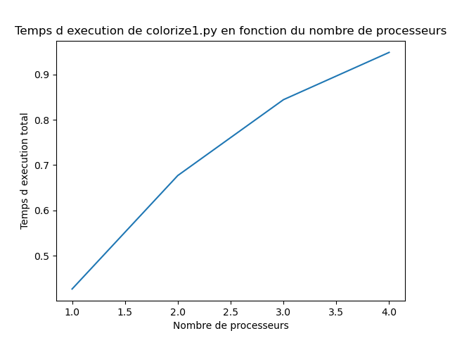

# Examen machine du 21 Mars 2023

## Configuration de l'ordinateur utilisé :

Nombre de coeurs physiques de la machine : 4
  
Nombre de coeurs logiques de la machine : 4

Quantité de mémoire cache L2 et L3 de la machine :

Cache L1d : 128 KiB

Cache L1i : 128 KiB

Cache L2 : 1 MiB

Cache L3 : 6 MiB

## Colorisation d'une photo noir et blanc

Le but de ce programme est de paralléliser un algorithme qui colorie une photo noir et blanc à partir d'une photo marquée.

### Parallélisation 

Dans un premier temps, faites une partition de l'image en nbp tranches d'images et demandez à chaque processus d'essayer de coloriser sa portion d'image à partir des conditions de Dirichlet correspondant à sa portion d'image et en construisant une matrice uniquement locale à cette portion d'image. Vous nommerez le fichier parallélisé **colorize1.py**.

Le calcul du speed up pour cette version de parallélisation, donne les résultats suivants : 

voici les images que j'ai obtenu pour respectivement 1,2,3 et 4 processeurs : 

Bien que le résultat obtenu soit convenable, cette stratégie peut mener à des portions d'images qui soient non colorées car il se peut que certains morceaux marqués par la couleur dans l'image 'marquée' ne soient pas sur la portion calculée par le processus.

Dans un deuxième temps, construire une partie de la matrice globale (correspondant à l'image complète) et paralléliser les produits matrice-vecteur ainsi que le gradient conjugué afin de résoudre un problème global en parallèle plutôt que plusieurs problèmes locaux. Vous nommerez le fichier parallélisé **colorize2.py**.

Je n'ai pas eu le temps de finir cette partie, cependant, voilà comment j'aurais procédé :

J'aurais divisé la matrice globale en plusieurs sous matrices en fonctions du nombre de processeurs, de façon à pouvoir faire des calculs matriciels sans avoir besoin de communiquer entre les processus. Puis, j'aurais implémenté une méthode permettant de faire un calcul matriciel avec des "bouts" de matrices. 
